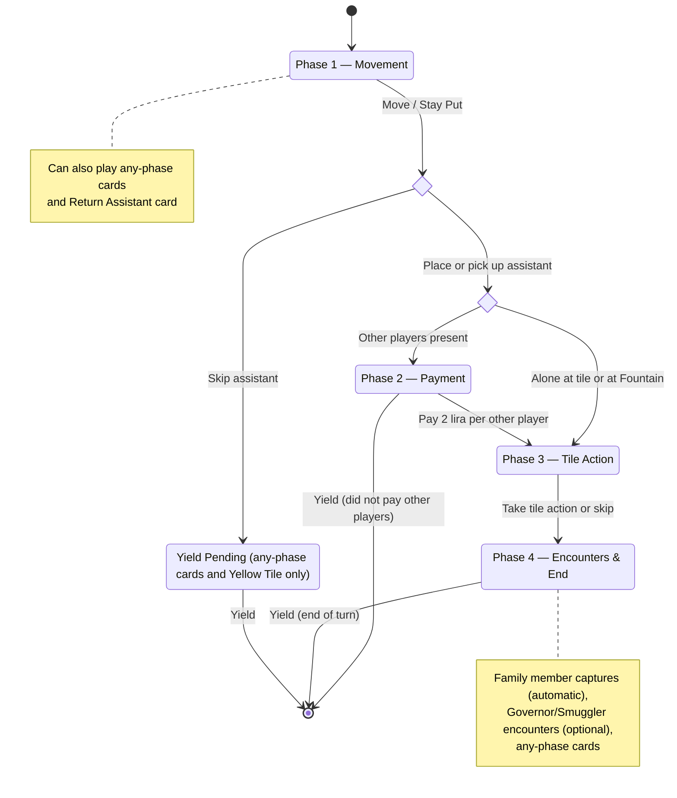

# Istanbul: Game Rules

This document describes the rules of Istanbul as implemented by this game engine.

## Overview

Istanbul is a strategy board game for 2-5 players. Players are merchants moving around a bazaar (a 4x4 grid of location tiles), collecting goods, earning lira (money), and acquiring rubies. The first player to collect enough rubies triggers the end of the game.

## Components

### Board

The board is a 4x4 grid of 16 location tiles. Locations are numbered 1-16 by their position on the grid:

```
 1  2  3  4     (row 0)
 5  6  7  8     (row 1)
 9 10 11 12     (row 2)
13 14 15 16     (row 3)
```

The 16 tiles are:

| Tile | Category |
|---|---|
| Great Mosque | Mosque |
| Post Office | Production |
| Fabric Warehouse | Warehouse |
| Small Mosque | Mosque |
| Fruit Warehouse | Warehouse |
| Police Station | Special |
| Fountain | Special |
| Spice Warehouse | Warehouse |
| Black Market | Dice |
| Caravansary | Cards |
| Small Market | Market |
| Tea House | Dice |
| Sultan's Palace | Trade |
| Large Market | Market |
| Wainwright | Upgrade |
| Gemstone Dealer | Rubies |

The assignment of tiles to grid positions can vary between games. The default layout places them in the order listed above (Great Mosque at position 1, Post Office at position 2, ..., Gemstone Dealer at position 16).

### Goods

There are four types of goods, each associated with a color:

| Good | Color | Warehouse |
|---|---|---|
| Fabric | Red | Fabric Warehouse |
| Spice | Green | Spice Warehouse |
| Fruit | Yellow | Fruit Warehouse |
| Jewelry | Blue | (no warehouse) |

Goods are stored in a player's cart. Jewelry (blue) is special: it cannot be obtained from a warehouse and has no dedicated warehouse.

### Cards

Bonus cards provide special abilities. There are 10 types:

| Card | When Playable | Effect |
|---|---|---|
| Take 1 Good | Any phase | Gain 1 good of your choice (added to cart, up to max) |
| Take 5 Lira | Any phase | Gain 5 lira |
| Arrest Family | Any phase | Return your family member to the Police Station and receive a reward (cannot be used if family member is already at the Police Station) |
| Extra Move | Phase 1 only | Move 3-4 spaces instead of 1-2 |
| Stay Put | Phase 1 only | Do not move; stay at your current location |
| Return Assistant | Phase 1 only | Return 1 of your assistants from the board to your stack (requires at least 1 assistant on the board) |
| Sell Any at Small Market | Phase 3 only | At the Small Market, sell any goods from your cart (ignoring demand; uses Small Market pricing; still sets new demand) |
| Double Sultan's Palace | Phase 3 only | At the Sultan's Palace, carry out the tile action twice |
| Double Post Office | Phase 3 only | At the Post Office, carry out the tile action twice |
| Double Gemstone Dealer | Phase 3 only | At the Gemstone Dealer, carry out the tile action twice |

"Any phase" cards (Take 1 Good, Take 5 Lira, Arrest Family) can be played at any point during your turn, including while a yield is pending after skipping your assistant. There is no limit to how many cards you may play in a single turn.

When a card is played, it is placed on the Caravansary's discard pile.

### Rubies

Rubies are the primary victory objective. There are five sources of rubies:

1. **Great Mosque pair** (1 ruby): Completing the Blue + Yellow mosque tile pair (see Mosque tiles)
2. **Small Mosque pair** (1 ruby): Completing the Red + Green mosque tile pair (see Mosque tiles)
3. **Sultan's Palace**: Trading goods for rubies (see Sultan's Palace)
4. **Wainwright**: Expanding your cart to maximum capacity (see Wainwright)
5. **Gemstone Dealer**: Buying rubies with lira (see Gemstone Dealer)

### Player Pieces

Each player has:

- **Merchant disc**: Represents the player's position on the board
- **4 assistants**: Form a stack that travels with the merchant; placed on tiles when visiting them
- **1 family member**: Starts at the Police Station; can be sent to other tiles

## Setup

1. Place the 16 tiles on the 4x4 grid (randomly or using a preset layout).
2. Place the **Governor** and **Smuggler** on their designated starting tiles.
3. Set the **Small Market** and **Large Market** initial demand (5 goods each).
4. Determine player order. Each player receives:
   - Their merchant disc and all 4 assistants (stack size = 4)
   - A cart with capacity 2 (can hold up to 2 of each good type)
   - Starting lira based on turn order: 1st player gets 2, 2nd gets 3, 3rd gets 4, etc.
   - 1 bonus card (dealt from the deck)
   - 0 rubies
   - Family member at the Police Station
5. All players start at the **Fountain**.

## Victory Condition

- **2 players**: First to **6 rubies** triggers the end.
- **3-5 players**: First to **5 rubies** triggers the end.

The game does not end immediately when a player reaches the ruby threshold. Instead, the current round is completed so that all players have taken the same number of turns. Specifically, the game ends when the **last player in turn order** yields their turn and at least one player has reached the ruby threshold.

**Tiebreaker**: If multiple players reach the threshold in the same round, they are ranked by (in order): most rubies, most lira, most total goods in cart, most cards in hand. If players are still tied after all four criteria, they share the victory.

## Turn Structure

Players take turns in order. A turn consists of up to four phases:

### Phase 1: Movement

The player **must** move their merchant to a new tile. Movement uses **taxicab distance** (Manhattan distance) on the 4x4 grid: the sum of horizontal and vertical steps.

- **Normal movement**: Move exactly 1 or 2 spaces.
- **Extra Move card**: Move exactly 3 or 4 spaces instead of 1 or 2.
- **Stay Put card**: Do not move; remain on the current tile.

You **cannot** stay on your current tile without playing the Stay Put card. You must move to a **different** tile.

**Assistant interaction upon arrival:**

When you arrive at a tile (or stay put), one of the following occurs:

- If **one of your assistants** is already at that tile: Pick up the assistant (return it to your stack). Your stack size increases by 1.
- If **no assistant** of yours is at that tile and your stack has at least 1 assistant: Place an assistant from your stack onto the tile. Your stack size decreases by 1.
- If **no assistant** of yours is at that tile and your stack is empty**: You may only do this at the **Fountain**. At any other tile, you cannot move there without an assistant to place.
- **Skip assistant**: You may **voluntarily** choose to skip the assistant interaction entirely, even if you could place or pick up an assistant. If you do, your turn ends immediately after resolving any "any phase" cards (Take 1 Good, Take 5 Lira, Arrest Family, or the Yellow Tile ability). You do not get a tile action, and you do not encounter the Governor/Smuggler.

### Phase 2: Payment

After arriving at a tile:

- If **you are the only player** at the tile, or the tile is the **Fountain**: Phase 2 is skipped automatically. Proceed to Phase 3.
- If **other players** are at the tile (and it is not the Fountain): You may **pay 2 lira to each other player** present at the tile to proceed to Phase 3, or you may **yield your turn** without paying, forfeiting your tile action and encounters. Yielding in Phase 2 is voluntary — you may choose not to pay even if you can afford it.

Note: Assistants from other players at the tile do not count as "other players" for payment purposes. Only merchant discs matter.

### Phase 3: Tile Action

You perform the action of the tile you are on. You may alternatively **skip** the tile action (but you still proceed to Phase 4). Each tile's action is described in the Tile Actions section below.

### Phase 4: Encounters and End of Turn

After the tile action (or after skipping it), the following occur:

- **Family member encounters**: If any other players' family members are at your current tile (and you are not at the Police Station), those family members are **captured**. Each captured family member is sent back to the Police Station. For each family member captured, the capturing player (you) receives a **reward**: choose either 3 lira or 1 bonus card from the deck.
- **Governor/Smuggler encounters**: If the Governor or Smuggler is at your current tile, you may interact with them (see Governor and Smuggler below).
- **"Any phase" cards**: You may play Take 1 Good, Take 5 Lira, or Arrest Family cards.

After all Phase 4 activities are complete, your turn ends and play passes to the next player.

## Tile Actions

### Warehouses (Fabric, Spice, Fruit)

**Action**: Fill your cart with the warehouse's good type to your cart's maximum capacity.

- Fabric Warehouse: Fill red (fabric) goods to max.
- Spice Warehouse: Fill green (spice) goods to max.
- Fruit Warehouse: Fill yellow (fruit) goods to max.

Example: If your cart max is 3 and you have 1 red, visiting the Fabric Warehouse sets your red to 3.

**Green Tile bonus**: If you have the green mosque tile, you may pay 2 lira to also gain 1 additional good of any type (red, green, yellow, or blue), added to your cart up to max. This replaces the normal warehouse action (you still fill the warehouse good to max as well).

### Fountain

**Action**: Return assistants from the board to your stack.

- **Default (generic action)**: Return **all** of your assistants from the board.
- **Selective**: You may choose to return only specific assistants instead of all of them.

The Fountain is special in two ways:
1. You **never pay** other players at the Fountain, even if other merchants are there.
2. You can visit the Fountain even if your **stack is empty** (you have no assistant to place). In this case, you simply arrive without placing an assistant.

### Post Office

**Action**: Receive goods and lira based on the current dial position, then advance the dial by one.

The Post Office has a rotating dial with 5 positions (0-4). Each time a player takes the action, they receive rewards based on the current position, then the position advances by 1 (wrapping from 4 back to 0).

The rewards are determined by two mail slots. For each slot:
- If the dial position is **greater than** the slot's index: receive the "early" reward.
- Otherwise: receive the "late" reward.

| Slot | Index | Early Good | Late Good | Early Lira | Late Lira |
|---|---|---|---|---|---|
| Slot 0 | 0 | Fabric (Red) | Spice (Green) | 2 | 1 |
| Slot 1 | 1 | Jewelry (Blue) | Fruit (Yellow) | 2 | 1 |

Summary of rewards by position:

| Position | Goods Received | Lira | Next Position |
|---|---|---|---|
| 0 | Green + Yellow | 2 | 1 |
| 1 | Red + Yellow | 3 | 2 |
| 2 | Red + Blue | 4 | 3 |
| 3 | Red + Blue | 4 | 4 |
| 4 | Red + Blue | 4 | 0 |

Goods received are added to your cart (up to max for each type). The dial starts at position 0.

### Great Mosque

**Action**: Acquire a mosque tile by paying goods of the matching color.

Available tiles: **Blue** (Jewelry) and **Yellow** (Fruit).

The cost for each tile color starts at 2 goods of that color and increases by 1 each time any player purchases that color's tile. After the 4th purchase, that color's tile is no longer available.

| Purchase # | Cost (in goods of that color) |
|---|---|
| 1st | 2 |
| 2nd | 3 |
| 3rd | 4 |
| 4th | 5 |
| 5th+ | No longer available |

Each player may only acquire each tile color once. With up to 5 players and 4 purchases available per color, not every player will be able to acquire every tile.

**Blue tile bonus**: When you acquire the blue tile, your assistant stack size permanently increases by 1 (you gain an extra assistant).

**Mosque pair ruby**: If acquiring a tile completes a pair, you gain 1 ruby:
- **Blue + Yellow** pair = 1 ruby
- **Red + Green** pair = 1 ruby (from Small Mosque tiles)

Each player can earn at most 2 rubies from mosques (one per pair).

### Small Mosque

**Action**: Same as Great Mosque, but offers **Red** (Fabric) and **Green** (Spice) tiles.

### Sultan's Palace

**Action**: Trade a specific combination of goods for 1 ruby.

The required goods follow a repeating cycle: Blue, Red, Green, Yellow, Any (wildcard). The total number of goods required increases by 1 after each purchase (by any player).

**2-3 player games**: The first purchase requires 5 goods.
**4-5 player games**: The first purchase requires 4 goods.

| Purchase # (from 4) | Required Goods |
|---|---|
| 4 goods | 1 Blue, 1 Red, 1 Green, 1 Yellow |
| 5 goods | 1 Blue, 1 Red, 1 Green, 1 Yellow, 1 Any |
| 6 goods | 2 Blue, 1 Red, 1 Green, 1 Yellow, 1 Any |
| 7 goods | 2 Blue, 2 Red, 1 Green, 1 Yellow, 1 Any |
| ... | Pattern continues cycling |
| 11+ goods | No more rubies available |

"Any" means any good type of your choice. The goods are removed from your cart.

### Small Market

**Action**: Sell goods to the market for lira.

The market has a **demand** of exactly 5 goods (a combination of the four types). You may sell any subset of goods from your cart, but you can only sell goods that the market demands, and only up to the demanded quantity of each type.

**Lira earned** depends on how many goods you sell. The Small Market's base price is 2 lira per good, with each additional good worth 1 more:

| Goods Sold | Lira Earned |
|---|---|
| 1 | 2 |
| 2 | 5 (2+3) |
| 3 | 9 (2+3+4) |
| 4 | 14 (2+3+4+5) |
| 5 | 20 (2+3+4+5+6) |

After selling, the market's demand is replaced with a **new demand** of exactly 5 goods (determined by the game/player).

### Large Market

**Action**: Same as Small Market, but with a higher base price of 3 lira:

| Goods Sold | Lira Earned |
|---|---|
| 1 | 3 |
| 2 | 7 (3+4) |
| 3 | 12 (3+4+5) |
| 4 | 18 (3+4+5+6) |
| 5 | 25 (3+4+5+6+7) |

### Gemstone Dealer

**Action**: Buy 1 ruby with lira.

The cost starts at a value determined by player count and increases by 1 lira after each purchase (by any player):

| Player Count | Starting Cost |
|---|---|
| 2 | 15 lira |
| 3 | 14 lira |
| 4-5 | 12 lira |

When the cost exceeds 24, no more rubies are available at the Gemstone Dealer.

### Wainwright

**Action**: Pay **7 lira** to increase your cart's maximum capacity by 1.

- Cart capacity starts at 2 and can be upgraded to a maximum of 5.
- When your cart reaches **maximum capacity (5)**, you gain **1 ruby**.
- The Wainwright has a limited supply of extensions: 3 per player in the game. When all extensions are sold, no more upgrades are available.

### Tea House

**Action**: Name a number (your "call"), then roll two dice.

- If the dice total **meets or exceeds** your call: gain lira equal to your call.
- If the dice total is **less than** your call: gain 2 lira.

Your call can be any positive integer, but since the maximum dice total is 12, calling higher than 12 guarantees you will only receive 2 lira.

### Black Market

**Action**: Choose 1 good (red, green, or yellow only — not blue) to add to your cart (up to max). Then roll two dice for a chance at bonus jewelry (blue goods):

| Dice Total | Bonus Blue Goods |
|---|---|
| 2-6 | 0 |
| 7-8 | 1 |
| 9-10 | 2 |
| 11-12 | 3 |

Blue goods from the bonus are added to your cart, each up to your cart's max.

### Caravansary

**Action**: Draw 2 bonus cards, then discard 1 card from your hand.

For each of the 2 cards drawn, you choose one source:
- **Deck**: Take any card type of your choice.
- **Discard pile**: Take the top card from the Caravansary's discard pile. You can only choose this if the discard pile is not empty. If you draw 2 cards from the discard pile, the first draw takes what was on top, and the second takes the next card down.

After drawing both cards, you must discard exactly 1 card from your hand onto the Caravansary's discard pile. This can be any card in your hand, including one you just drew.

### Police Station

**Action**: Send your family member from the Police Station to any other tile.

**Requirements**:
- Your family member must currently be at the Police Station.
- The destination cannot be the Police Station itself.

When your family member arrives at the destination tile, they carry out the **tile action** of that tile as if you were there. The family member does not interact with assistants, does not pay other players, and does not trigger family member captures.

The family member remains at the destination tile until they are captured by another player or recalled by the Arrest Family card.

## Governor

The Governor is a neutral figure that starts on a designated tile and moves around the board.

**Encounter**: If the Governor is on the same tile as you at the end of your turn (Phase 4), you may interact with them:

1. **Choose a card** to receive (any card type, added to your hand).
2. **Pay the cost**: either 2 lira **or** discard 1 card from your hand.
3. **Roll two dice**: The Governor moves to the tile corresponding to the dice sum on the roll-based location table (see below).

The Governor encounter is optional.

## Smuggler

The Smuggler is a neutral figure that starts on a designated tile and moves around the board.

**Encounter**: If the Smuggler is on the same tile as you at the end of your turn (Phase 4), you may interact with them:

1. **Choose a good** to receive (any type, added to your cart up to max).
2. **Pay the cost**: either 2 lira **or** trade 1 good from your cart.
3. **Roll two dice**: The Smuggler moves to the tile corresponding to the dice sum on the roll-based location table (see below).

The Smuggler encounter is optional.

## Roll-Based Location Table

When the Governor or Smuggler move, the dice sum determines their destination using this fixed mapping (independent of the board layout):

| Dice Sum | Tile |
|---|---|
| 2 | Fabric Warehouse |
| 3 | Spice Warehouse |
| 4 | Fruit Warehouse |
| 5 | Post Office |
| 6 | Caravansary |
| 7 | Fountain |
| 8 | Black Market |
| 9 | Tea House |
| 10 | Large Market |
| 11 | Small Market |
| 12 | Police Station |

Note: Only sums 2-12 are possible with two dice. Tiles not in this table (Wainwright, Great Mosque, Small Mosque, Sultan's Palace, Gemstone Dealer) cannot be Governor/Smuggler destinations via dice. The actual board position of the destination tile depends on the game's tile layout.

## Mosque Tiles (Special Abilities)

Mosque tiles are acquired at the Great Mosque and Small Mosque. In addition to contributing to mosque pair rubies, some tiles grant ongoing abilities:

| Tile Color | Mosque | Ability |
|---|---|---|
| Blue | Great Mosque | +1 assistant (stack size increases permanently when acquired) |
| Yellow | Great Mosque | Pay 2 lira at any time during your turn to return 1 assistant from the board to your stack |
| Red | Small Mosque | When rolling dice at the Tea House or Black Market, you may either change one die to 4 or reroll both dice, using the new result |
| Green | Small Mosque | At a warehouse, pay 2 lira to gain 1 additional good of any type (on top of the normal warehouse fill) |

### Yellow Tile Details

The yellow tile ability can be used during any phase of your turn, even after skipping your assistant. It costs 2 lira each use. It returns an assistant from a specific board location back to your stack.

### Red Tile Details

The red tile modifies a dice roll. You have two options:
- **Change to four**: Set one die (your choice) to 4, keeping the other die unchanged.
- **Reroll**: Reroll both dice and use the new result.

This can be used at the Tea House and Black Market. It does not apply to the Governor/Smuggler movement rolls.

## Cart

Each player has a cart that stores goods.

- **Starting capacity**: 2 (can hold up to 2 of **each** good type).
- **Maximum capacity**: 5 (after 3 Wainwright upgrades).
- The capacity limit applies **per good type**, not total. At capacity 3, you can hold up to 3 red, 3 green, 3 yellow, AND 3 blue simultaneously (up to 12 goods total).
- When you would gain a good and you are already at max for that type, the gain is simply ignored (you do not lose anything).

## Family Member

Each player has one family member.

- Starts at the Police Station.
- Can be sent to other tiles via the Police Station tile action.
- When another player visits a tile where your family member is, your family member is **captured**: sent back to the Police Station, and the capturing player receives a reward (3 lira or 1 bonus card).
- The Arrest Family card returns your own family member to the Police Station and gives you a reward.
- Family members at the Police Station cannot be captured (the Police Station is exempt from captures).
- When your family member acts at a destination tile (via Police Station), they do not trigger family member captures at that location.

## Detailed Phase Rules

### Cards Playable by Phase

| Phase | Cards Available |
|---|---|
| Phase 1 (Movement) | Take 1 Good, Take 5 Lira, Arrest Family, Extra Move, Stay Put, Return Assistant |
| Phase 2 (Payment) | Take 1 Good, Take 5 Lira, Arrest Family |
| Phase 3 (Tile Action) | Take 1 Good, Take 5 Lira, Arrest Family, Sell Any, Double Sultan's Palace, Double Post Office, Double Gemstone Dealer |
| Phase 4 (Encounters) | Take 1 Good, Take 5 Lira, Arrest Family |

Phase 3 "double" cards can only be played at the corresponding tile.

The Sell Any card can only be played at the Small Market.

### Yield (Ending Your Turn)

You can yield (end your turn early) in **Phase 2** or **Phase 4**:

- **Phase 2 yield**: You choose not to pay other players at your location (this is voluntary — you may yield even if you could afford to pay). You forfeit your tile action and encounters.
- **Phase 4 yield**: Normal end of turn after completing (or skipping) the tile action and resolving encounters.

If you skipped your assistant interaction during movement, you **must yield** as soon as possible. The only actions allowed before yielding in this state are: Take 1 Good, Take 5 Lira, Arrest Family, and Yellow Tile (return assistant).

## Game End Timing

The game ends when **all** of the following are true:
1. At least one player has reached the ruby threshold (5 for 3-5 players, 6 for 2 players).
2. The last player in turn order has completed their turn (yielded).

This means the player who reaches the threshold first does not necessarily win if another player catches up or surpasses them by the end of the round.

## Turn Structure Diagram


